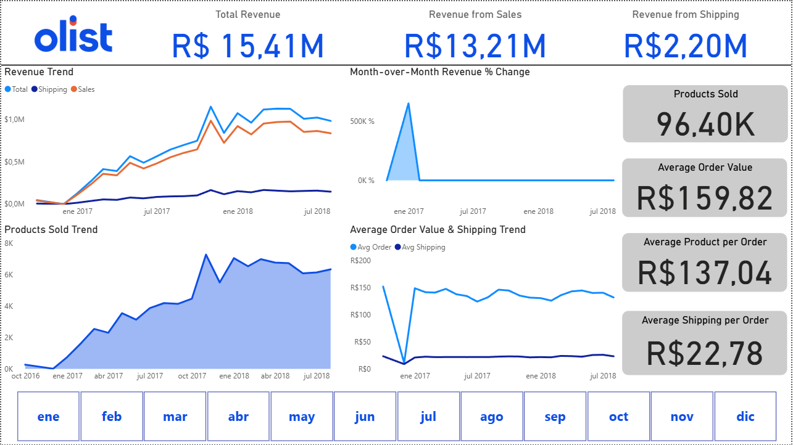
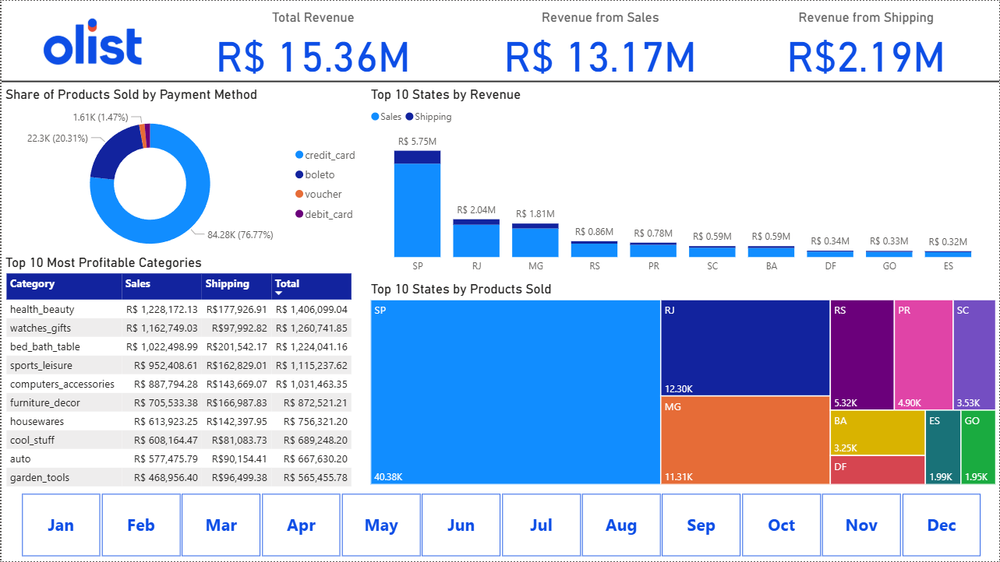

# 📊 End-to-End Business Intelligence Project | Brazil E-commerce Analytics

This project simulates a corporate Business Intelligence environment using the Brazilian E-commerce Public Dataset provided by Olist.

It replicates a real analytical workflow: loading raw CSV files into a local SQL Server database, transforming transactional data using SQL, and developing an executive dashboard in Power BI for performance analysis.

---

## 🗄 Data Source

Dataset: Brazilian E-Commerce Public Dataset by Olist    
Reference: https://doi.org/10.34740/kaggle/dsv/195341 

To simulate a real corporate environment:

- Raw CSV files were imported into a local Microsoft SQL Server database.
- A structured relational model was created.
- SQL transformations were applied to build an analytical fact table at order-item level.
- The dataset was optimized for executive reporting in Power BI.

This approach mirrors enterprise BI workflows where analytical models are built directly from relational databases.

📅 Period analyzed: January 2017 – August 2018
(Orders prior to 2017 were excluded due to negligible transaction volume.)

---

## 🚀 Project Highlights

- End-to-end ETL process using SQL Server.
- Creation of an analytical dataset from normalized transactional tables.
- Business metric design (revenue, AOV, shipping contribution).
- Executive dashboard development in Power BI.
- Identification and quantification of a category classification gap impacting revenue analysis.
- Simulation of a real-world BI workflow from database to executive reporting.

---

## 🛠 Tech Stack

- Microsoft SQL Server
- SQL
- ETL (Extract, Transform, Load)
- Power BI
- DAX

---

## 📈 Power BI Dashboard

The report is structured into two main analytical pages.

### 🔹 Shared KPIs (Available in Both Pages)

The following core metrics are displayed consistently across both dashboards:

- Total Revenue
- Revenue (Sales)
- Revenue (Shipping)

These KPIs provide a unified performance reference across different analytical perspectives.

---

### 1️⃣ Performance Overview

Focus: Executive-level performance monitoring.

Includes:

- Total products sold
- Average Order Value (AOV)
- Average product revenue per order
- Average shipping revenue per order
- Revenues and products sold time-series evolution
- Monthly Growth (MoM %)
- Total Revenue and Average Product Revenue per Order Over the Year
- Dynamic month slicer



---

### 2️⃣ Segment Performance

Focus: Regional and product segmentation analysis.

Includes:

- Top 10 Brazilian states by revenue
- Top 10 Brazilian states by products sold
- Top 10 most profitable product categories
- Payment type distribution
- Monthly filtering interaction



---

## 🎯 Business Objective

This project aims to demonstrate how raw transactional data can be transformed into actionable business insights by:

- Monitoring revenue performance
- Understanding logistics contribution (shipping vs sales)
- Evaluating time-series growth
- Analyzing regional and product-level segmentation
- Detecting structural data quality gaps
- Supporting strategic decision-making

---

## 🌐 Full BI Analysis

The complete strategic analysis, insights interpretation, and executive commentary are available in my portfolio:

🔗 Portfolio (Full Business Analysis):
[https://www.notion.so/End-to-End-Business-Intelligence-Project-Brazil-E-commerce-Analytics-30b43fe0ba2e8062967ded3fd84260ff](https://www.notion.so/End-to-End-Business-Intelligence-Project-Brazil-E-commerce-Analytics-30b43fe0ba2e8062967ded3fd84260ff)

---

## 📌 Repository Structure

```
ecommerce-analytics-brazil/
│
├── README.md
├── sql/
│   └── sales_etl_for_power_bi.sql
├── powerbi/
│   └── ecommerce_dashboard.pbix
└── images/
    ├── performance_overview.png
    └── segment_performance.png
```

---

## 👤 Author

Santino Adduca  
Data Analyst | Data Scientist  
Buenos Aires, Argentina

If you would like to discuss this project or explore potential collaboration opportunities, feel free to reach out via email or connect with me on LinkedIn.
